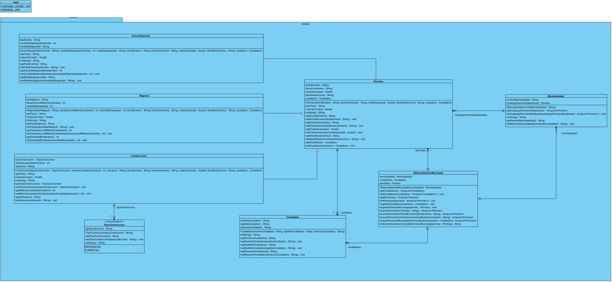

### Gestion de Permisos Municipales
Este proyecto consiste en el desarrollo de un sistema para la gestión de permisos municipales que permite a los ciudadanos solicitar permisos relacionados con negocios, construcciones y eventos especiales a través de la plataforma Municipalidad.

#### Clases Principales
* Ciudadano: Representa a un ciudadano que realiza solicitudes de permisos municipales.
* Construccion (clase hija): Clase que hereda de Permiso, utilizada para gestionar permisos relacionados con construcciones.
* EventoEspecial (clase hija): Clase que hereda de Permiso, utilizada para gestionar permisos relacionados con eventos especiales.
* Negocio (clase hija): Clase que hereda de Permiso, utilizada para gestionar permisos relacionados con negocios.
* Permiso: Clase que representa un permiso municipal en general.
* Municipalidad: Clase encargada de gestionar los permisos y ciudadanos registrados en el sistema.
* TipoConstruccion: Enumeración que define los tipos de construcciones para los permisos.
* SistemaGestionMunicipal: Clase principal que controla el flujo del sistema de gestión municipal.
#### Funcionalidades a Probar
El sistema debe ser capaz de probar las siguientes funcionalidades:

* Registrar ciudadanos y permisos municipales.
* Buscar todos los permisos municipales de un ciudadano.
* Buscar permisos por tipo, fecha de emisión y fecha de vencimiento.
* Mostrar todos los permisos municipales de un ciudadano.
* Obtener información completa de un permiso municipal.
#### Tarifas
Las tarifas para los permisos municipales son las siguientes:

* Por metro cuadrado: $150,000
* Por empleado: $20,000
* Por cada 100 asistentes: $100,000

¡El sistema de gestión municipal busca agilizar y facilitar el proceso de solicitud y emisión de permisos para los ciudadanos y la administración municipal!

#### Diagrama de Clases UML:

####
#### Resultado de pruebas realizadas en IntelliJ IDEA:
[Permiso: 1223
Fecha de emision: 09/04/2023
Fecha de vecimiento: 09/04/2030
Costo asociado: 100000.0
Ciudadano: Nombre: Maria
Apellido: Lopez
Direccion: Calle 2

Tipo de construccion: Comercial
Metros cuadrados a construir: 200
Ubicacion: calle falsa 123
]
[Permiso: 123
Fecha de emision: 09/04/2023
Fecha de vecimiento: 09/04/2030
Costo asociado: 100000.0
Ciudadano: Nombre: Juan
Apellido: Perez
Direccion: Calle 1

Tipo de negocio: market
Tamaño del local en metros cuadrados: 300
Cantidad de empleados: 3
, Permiso: 1223
Fecha de emision: 09/04/2023
Fecha de vecimiento: 09/04/2030
Costo asociado: 100000.0
Ciudadano: Nombre: Maria
Apellido: Lopez
Direccion: Calle 2

Tipo de construccion: Comercial
Metros cuadrados a construir: 200
Ubicacion: calle falsa 123
]
[Permiso: 123
Fecha de emision: 09/04/2023
Fecha de vecimiento: 09/04/2030
Costo asociado: 100000.0
Ciudadano: Nombre: Juan
Apellido: Perez
Direccion: Calle 1

Tipo de negocio: market
Tamaño del local en metros cuadrados: 300
Cantidad de empleados: 3
, Permiso: 1223
Fecha de emision: 09/04/2023
Fecha de vecimiento: 09/04/2030
Costo asociado: 100000.0
Ciudadano: Nombre: Maria
Apellido: Lopez
Direccion: Calle 2

Tipo de construccion: Comercial
Metros cuadrados a construir: 200
Ubicacion: calle falsa 123
]
[Permiso: 123
Fecha de emision: 09/04/2023
Fecha de vecimiento: 09/04/2030
Costo asociado: 100000.0
Ciudadano: Nombre: Juan
Apellido: Perez
Direccion: Calle 1

Tipo de negocio: market
Tamaño del local en metros cuadrados: 300
Cantidad de empleados: 3
]
[Permiso: 1223
Fecha de emision: 09/04/2023
Fecha de vecimiento: 09/04/2030
Costo asociado: 100000.0
Ciudadano: Nombre: Maria
Apellido: Lopez
Direccion: Calle 2

Tipo de construccion: Comercial
Metros cuadrados a construir: 200
Ubicacion: calle falsa 123
]
Permiso: 123
Fecha de emision: 09/04/2023
Fecha de vecimiento: 09/04/2030
Costo asociado: 100000.0
Ciudadano: Nombre: Juan
Apellido: Perez
Direccion: Calle 1

Tipo de negocio: market
Tamaño del local en metros cuadrados: 300
Cantidad de empleados: 3
Permiso: 123
Fecha de emision: 09/04/2023
Fecha de vecimiento: 09/04/2030
Costo asociado: 100000.0
Ciudadano: Nombre: Juan
Apellido: Perez
Direccion: Calle 1

Tipo de negocio: market
Tamaño del local en metros cuadrados: 300
Cantidad de empleados: 3

Process finished with exit code 0

